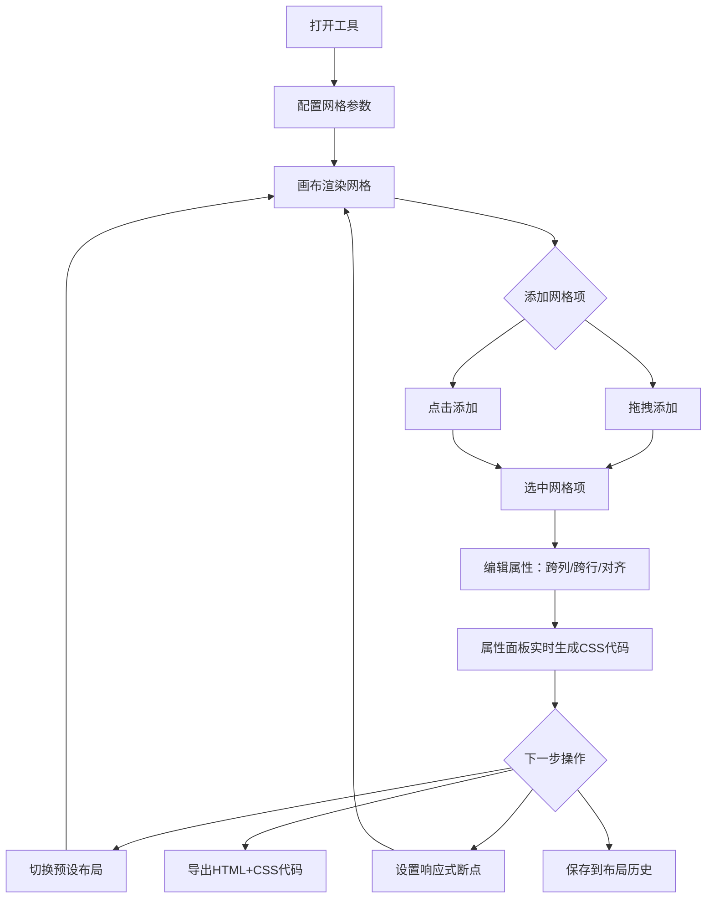

## 1. 产品概述

CSS Grid 可视化布局工具 —— 一款面向前端开发者的交互式网格布局设计器，通过可视化拖拽操作生成标准 CSS Grid 代码，降低网格布局的学习与调试成本。

- 解决问题：CSS Grid 属性组合复杂，手写代码调试效率低，缺乏直观的可视化反馈
- 目标用户：前端开发者、UI 设计师、CSS 学习者

## 2. 核心功能

### 2.1 功能模块

1. **主工作区页面**：画布区域、工具栏、属性面板、代码预览面板

### 2.2 页面详情

| 页面名称 | 模块名称 | 功能描述 |
|---------|---------|---------|
| 主工作区 | 网格画布 | 可视化渲染 CSS Grid 布局，实时显示网格线与单元格 |
| 主工作区 | 工具栏 | 配置列数、行数、列宽、行高、间距等网格参数 |
| 主工作区 | 拖拽区域 | 拖拽添加网格项到画布，支持拖拽排序 |
| 主工作区 | 网格项编辑 | 选中网格项后调整跨列数、跨行数、对齐方式 |
| 主工作区 | 属性面板 | 实时显示当前网格的 CSS 代码（grid-template-columns/rows、gap 等） |
| 主工作区 | 预设布局 | 一键切换圣杯布局、侧边栏布局、卡片网格、杂志排版 |
| 主工作区 | 导出功能 | 导出完整 HTML+CSS 代码片段，支持复制到剪贴板 |
| 主工作区 | 响应式断点 | 为不同屏幕尺寸定义不同的网格配置 |
| 主工作区 | 布局历史 | 使用 localStorage 保存布局历史，支持恢复 |

## 3. 核心流程

用户打开工具后，在工具栏设置网格基础参数（行列数、尺寸、间距），画布实时渲染网格。通过拖拽或点击添加网格项到画布，选中网格项可在属性面板中调整其跨列、跨行和对齐方式。右侧属性面板同步生成对应的 CSS Grid 代码。用户可切换预设布局快速起步，也可为不同屏幕断点配置差异化布局。完成后导出代码或保存到历史记录。

## 4. 用户界面设计

### 4.1 设计风格

- 主色调：深色背景 (#0F1117) + 青绿强调色 (#00D4AA)，营造专业开发者工具氛围
- 辅助色：暗灰面板 (#1A1D27)、边框色 (#2A2D3A)、文字色 (#E0E0E8)
- 按钮风格：圆角微凸起，hover 时边框高亮
- 字体：代码区域使用 JetBrains Mono，UI 文本使用 DM Sans
- 布局风格：三栏式 —— 左侧工具栏、中间画布、右侧属性/代码面板
- 图标风格：线性图标 (Lucide)

### 4.2 页面设计概览

| 页面名称 | 模块名称 | UI元素 |
|---------|---------|--------|
| 主工作区 | 网格画布 | 深色背景、网格线虚线、网格项圆角卡片、选中高亮边框 |
| 主工作区 | 工具栏 | 紧凑侧边栏，数字输入框+滑块，预设布局按钮组 |
| 主工作区 | 属性面板 | 代码块深色高亮，语法着色，一键复制按钮 |
| 主工作区 | 拖拽区域 | 虚线拖拽目标区，拖入时高亮反馈 |

### 4.3 响应式

桌面优先设计，工具栏和面板在小屏幕时可折叠收起。画布区域自适应缩放。

### 4.4 动效设计

- 网格项拖入时弹性动画入场
- 选中网格项脉冲边框动画
- 预设布局切换时网格平滑过渡
- 代码面板更新时高亮闪烁
