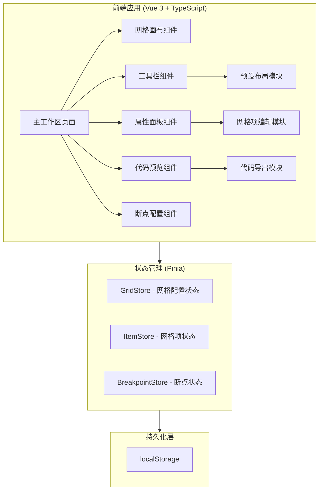

## 1. 架构设计



## 2. 技术说明

- 前端：Vue 3 + TypeScript + Tailwind CSS
- 构建工具：Vite
- 状态管理：Pinia
- 路由：Vue Router（单页面，备用扩展）
- 图标：Lucide Icons (lucide-vue-next)
- 持久化：localStorage
- 初始化工具：vite-init (vue-ts 模板)

## 3. 路由定义

| 路由 | 用途 |
|------|------|
| / | 主工作区页面，包含画布、工具栏、属性面板 |

## 4. 核心数据模型

### 4.1 网格配置 (GridConfig)

```typescript
interface GridConfig {
  columns: number
  rows: number
  columnWidths: string[]       // e.g. ['1fr', '200px', '2fr']
  rowHeights: string[]         // e.g. ['auto', '1fr', 'auto']
  columnGap: number            // px
  rowGap: number               // px
}
```

### 4.2 网格项 (GridItem)

```typescript
interface GridItem {
  id: string
  label: string
  columnStart: number
  columnEnd: number
  rowStart: number
  rowEnd: number
  justifySelf: 'start' | 'center' | 'end' | 'stretch'
  alignSelf: 'start' | 'center' | 'end' | 'stretch'
  backgroundColor: string
}
```

### 4.3 响应式断点 (BreakpointConfig)

```typescript
interface BreakpointConfig {
  name: string           // e.g. 'mobile', 'tablet', 'desktop'
  minWidth: number       // px
  gridConfig: GridConfig
  items: GridItem[]
}
```

### 4.4 布局历史 (LayoutHistory)

```typescript
interface LayoutHistory {
  id: string
  name: string
  timestamp: number
  gridConfig: GridConfig
  items: GridItem[]
  breakpoints: BreakpointConfig[]
}
```

## 5. 组件结构

```
src/
├── components/
│   ├── GridCanvas.vue          # 网格画布 - 可视化渲染网格
│   ├── GridItemCard.vue        # 网格项卡片 - 单个网格项渲染
│   ├── ToolBar.vue             # 工具栏 - 网格参数配置
│   ├── ItemEditor.vue          # 网格项编辑器 - 属性调整
│   ├── CodePanel.vue           # 代码面板 - CSS 代码预览
│   ├── PresetLayouts.vue       # 预设布局 - 快速切换
│   ├── BreakpointEditor.vue    # 断点编辑器 - 响应式配置
│   ├── ExportModal.vue         # 导出弹窗 - 代码导出
│   └── HistoryPanel.vue        # 历史面板 - 布局历史
├── composables/
│   ├── useGrid.ts              # 网格操作逻辑
│   ├── useDragDrop.ts          # 拖拽逻辑
│   ├── useExport.ts            # 导出逻辑
│   └── useLocalStorage.ts      # localStorage 读写
├── stores/
│   ├── gridStore.ts            # 网格配置状态
│   └── historyStore.ts         # 布局历史状态
├── types/
│   └── index.ts                # TypeScript 类型定义
├── presets/
│   └── index.ts                # 预设布局数据
├── pages/
│   └── Workspace.vue           # 主工作区页面
├── App.vue
└── main.ts
```

## 6. 关键技术实现

### 6.1 网格画布渲染

使用 CSS Grid 本身来渲染可视化画布，通过动态绑定 `grid-template-columns`、`grid-template-rows`、`gap` 等属性实现实时预览。

### 6.2 拖拽实现

使用 HTML5 Drag and Drop API，在画布上监听 dragover/drop 事件，根据鼠标位置计算目标单元格坐标。

### 6.3 CSS 代码生成

基于当前 GridConfig 和 GridItem[] 实时生成对应的 CSS Grid 代码字符串，包含媒体查询（断点配置）。

### 6.4 响应式断点

维护一个 BreakpointConfig 数组，每个断点存储独立的网格配置和网格项布局。导出时生成对应的 @media 查询代码。
